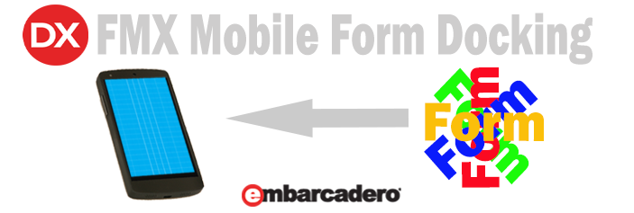
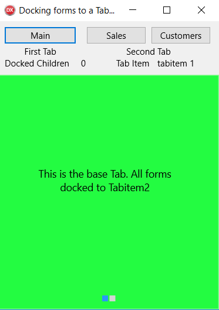
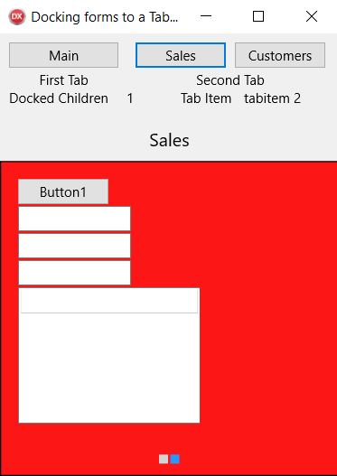
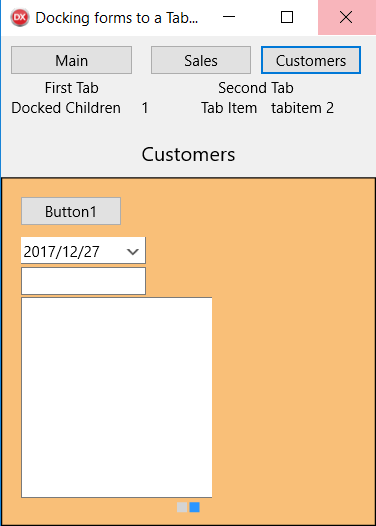

**Background**

When working with mobile applications, trying to place all your code on one form
can become cumbersome. So to overcome this you will need to create forms and
dock forms onto a main form permanently or temporarily. If you believed that FMX
form Docking is the same as VCL, then this blog will help you to make the new
implementation easier because the FMX method is a lot different from the VCL
method.

**IDE**

Tokyo 10.2 used, this should be backwards compatible to Post XE4 versions.

**Scope**

Dock different forms to a specific tab-item in the tab-control of a form and
free them when required.

**Requirements**

Standard FMX Library.

Difficulty level - Low.

**Method**

**How does it work?**

-   The Form to be ‘**Docked to’** must have a Tlayout or Tpanel or similar
    which becomes the Parent object to be docked to.

-   The Form to be ‘**Dockedfrom**’ must have a Tlayout or Tpanel or similar
    which becomes the Child of the Parent.

-   All the children ( Tedits, Tbuttons,Tlabels, etc) of the ‘**DockedFrom**’
    form become the children of the Parent and are added in the order in which
    they were created at design time.

So if you will be reusing the ‘**Dockedto**’ as the parent to add and remove
different forms,

>   a new step will need to be added else further docking will result in the
>   loaded form’s children being overlaid on each other resulting in an unusable
>   mess.

>   Lets name the ‘**Dockedto’** Tlayout object as **DockedLayout** and we will
>   refer to it as this.

-   Before loading a form to the **DockedLayout**, we need to check if an
    existing form has been loaded. These would be children of the
    **DockedLayout**. We use the method ‘**Childrencount ‘** and check if the
    count is greater than 0. If true then the docked children are removed.

-   The principle for removing the children is LIFO - Last in first out and the
    child items are removed one at a time from the **Dockedlayout**.

-   To remove the Children we need to call the correct method for the platform
    to free each child.

-   So we use If Def’s to call different methods for freeing the children for
    the different Platforms.

-   To remove Android or IOS children, the **disposeof** method is used and for
    Windows, the **free** method will remove the child.

-   Now that the previous forms children have been freed, can we now create the
    form and add.

-   To add, make the ‘**dockedfrom**’form’s Tlayout that contains its children,
    the dockedlayout’s children.

-   We now have a docked method implementation that works on Android, Windows
    and IOS.

Lets take a look at the downloadable example code used for docking a Salesform
to the Main Form :-

procedure Tfmmain.SalesClick(Sender: TObject);

var

i:integer;

childform:Tfmsales; // sets a child form of the form Sales

begin

DockLayout.ClipChildren:= true;

if DockLayout.childrencount \> 0 then

begin

for i := (DockLayout.childrencount - 1) downto 0 do

begin

{\$IF DEFINED(IOS) or DEFINED(ANDROID)}

DockLayout.Children.items[i].Disposeof; // frees any children if already set

{\$ELSE} // Windows

DockLayout.Children.items[i].Free; // frees any children if already set

{\$ENDIF}

end; //frees the existing loaded form

end;

label3.Text:= '0';

childform:= Tfmsales.Create(self); //Creates the childform.

childform.layoutsales.Parent:= Self.DockLayout; //set childform to the parent

tabcontrol1.activetab:= tabitem2;

label3.text:=DockLayout.childrencount.tostring;

end;

The two different Docked Forms…

It is really is easy once you understand the Parent / Child relationship.

Happy Coding
